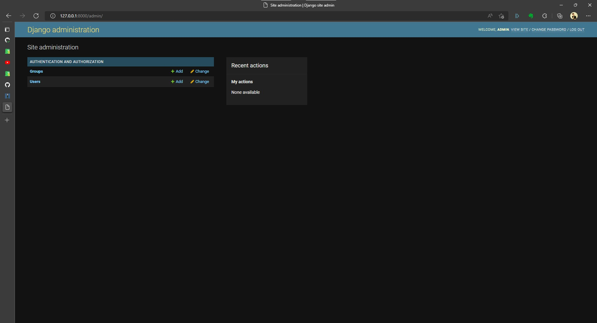

# Admin Paneli

Django kendi içinde bir admin paneli bulundurur. Bu admin paneline erişim için öncelikle bir superuser oluşturmamız gerekir. Bunu yapmak terminal yoluyla çok kolaydır.

```powershell
py manage.py createsuperuser
```

Sistem bizden burada isim (boş girilmesi durumunda varsayılan oturum kullanıcı adı), e-posta adresi ve parola isteyecektir. Bunların doldurulması sonrasında superuser oluşturulacaktır.



Burada blog içindeki veri tabanına erişebilmemiz için blog içinden modelimizi admine kaydetmemiz gerekecektir.

```python title="blog/admin.py"
    from django.contrib import admin
    # highlight-start
    from . import models
    
    admin.site.register(models.Post)
    # highlight-end
```