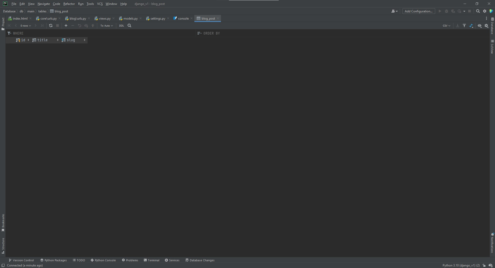

# Model Kullanımı

Model, Django içerisinde veri tabanı ilişkilendirmesi yapmamızı sağlayan alandır. Örnek bir blog postunda başlık, içerik ve slug alanlarının bulunduğunu düşünecek olursak, bizim oluşturacağımız modelde bu üç alan için gerekli tanımlamaların yapılması uygundur.


```python title="blog/models.py"

from django.db import models


class Post(models.Model):
    title = models.CharField(max_length=155)
    content = models.TextField
    slug = models.SlugField(max_length=255)
    # highlight-start
    def __str__(self):
        return self.title
    # highlight-end
    
```
Buradaki `def __str__(self)` fonksiyonu, modelden varsayılan olarak hangi alanın döndürüleceğini gösterir. Sadece title değil diğer alanlarla birlikte de veri döndürülebilir.

Bu kısımda models içinde desteklenen alanlara (field) değinmekte fayda var. Detaylı bilgi için [**Django'nun Sitesini**](https://docs.djangoproject.com/en/4.1/ref/models/fields/#field-types) inceleyebiliriz.

Bundan sonrasında blog uygulamamızın modelini ve diğer alanlarını kullanabilmek için Django içine bunu kaydetmemiz gerekiyor. Core içindeki `settings.py` içine gidip uygulamamızı kaydetmemiz gerekiyor.

```python title="core/settings.py"

INSTALLED_APPS = [
    'django.contrib.admin',
    'django.contrib.auth',
    'django.contrib.contenttypes',
    'django.contrib.sessions',
    'django.contrib.messages',
    'django.contrib.staticfiles',
    # highlight-start
    'blog',
    # highlight-end
]

```

Sonrasında terminal üzerinden `makemigrations` komutunu çalıştırarak modelimizdeki değişiklikleri uygulamamız gerekecektir.

```powershell
py manage.py makemigrations
```

Ardından `migrate` komutu ile değişiklikleri veri tabanına uygulayacağız.

```powershell
py manage.py migrate
```

:::note
Bu kısım ilk çalıştırıldığında uzun sürebilir çünkü ilk çalıştırmamızda çok sayıda modelin migrasyonu yapılmayacağı için ilk migrate komutunda bu işlemler de migrate edilecektir.
:::

Kullandığımız editör üzerinden bu veri tabanını görüntüleyebiliriz. Örnek olarak PyCharm içinde bu veri tabanına girdiğimizde ve oluşuturduğumuz post modeline baktığımızda karşımıza şu şekilde bir alan çıkacaktır.




Bu kısımda bir bilgi vermek gerekirse content alanımız eklenmeyebilir. Yeniden eklemek için models içindeki content değişkenini şu şekilde güncelleyebiliriz.

```python title="blog/models.py"

content = models.TextField(null=True)

```

Sonrasında content alanımız da eklenecektir. Bundan sonrasında admin paneli üzerinden yeni veriler ekleyebiliriz.


